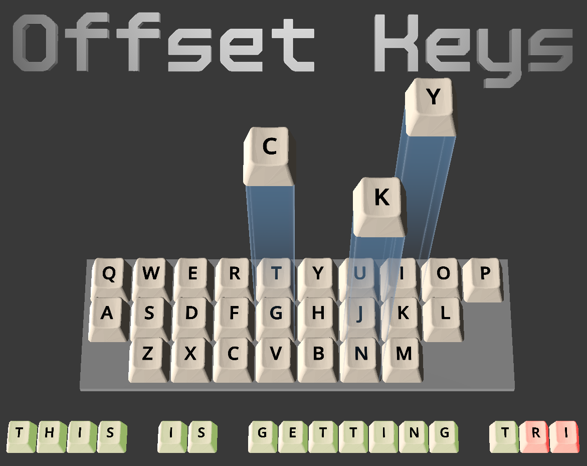

Developed for the Go Godot Jam 4, my first game jam participation! Thanks for organizing / participating /&nbsp;playing / judging! 

<strong>Controls:</strong> A-Z keys +&nbsp;Arrow keys If your keyboard isn't QWERTY, you can and should&nbsp;change the in-game keyboard layout to&nbsp; QWERTZ or AZERTY in the settings.

<strong>Credits:</strong> <a href="https://github.com/bitbrain">project template by bitbrain</a> <a href="https://cults3d.com/en/3d-model/home/keyboard-button">keycap mesh by Polymorph</a> <a href="https://fontlibrary.org/en/font/generale-station">Générale Station font by Ariel Martín Pérez</a> <a href="https://pixabay.com/music/beautiful-plays-please-calm-my-mind-125566/">“Please Calm My Mind” music by Lesfm </a><a href="https://opengameart.org/content/202-more-sound-effects">Dropping sounds by OwlishMedia</a> <a href="https://opengameart.org/content/gui-sound-effects">Positive / negative sound by Lokif</a>&nbsp;(pitched to match the music's key)

